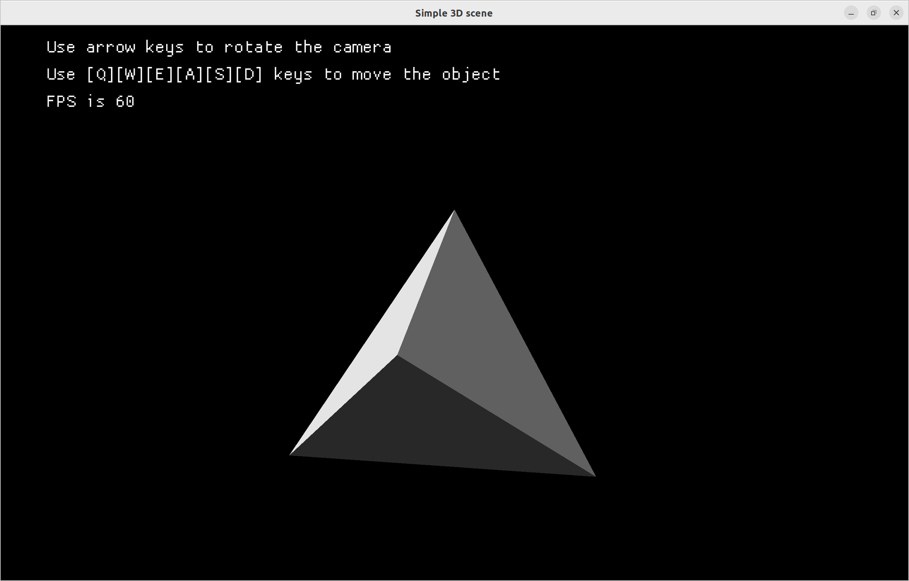
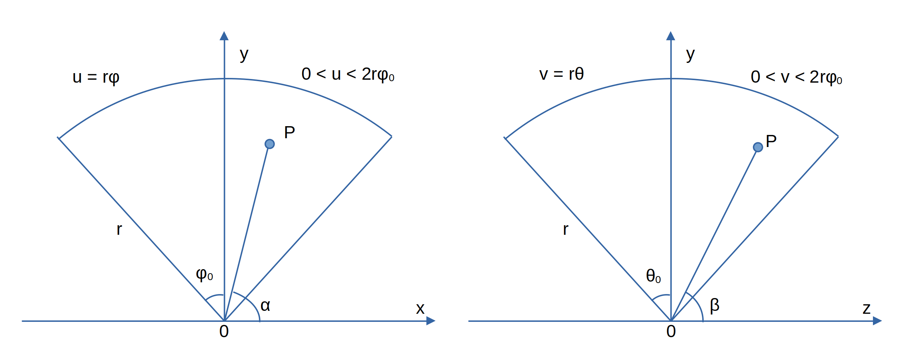
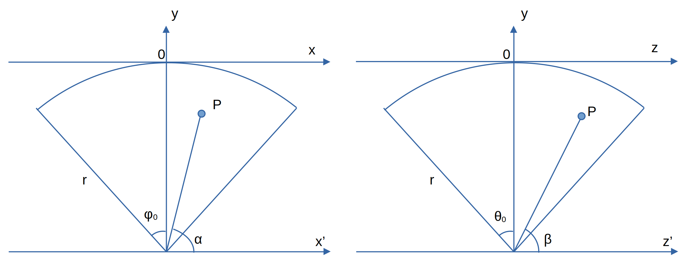
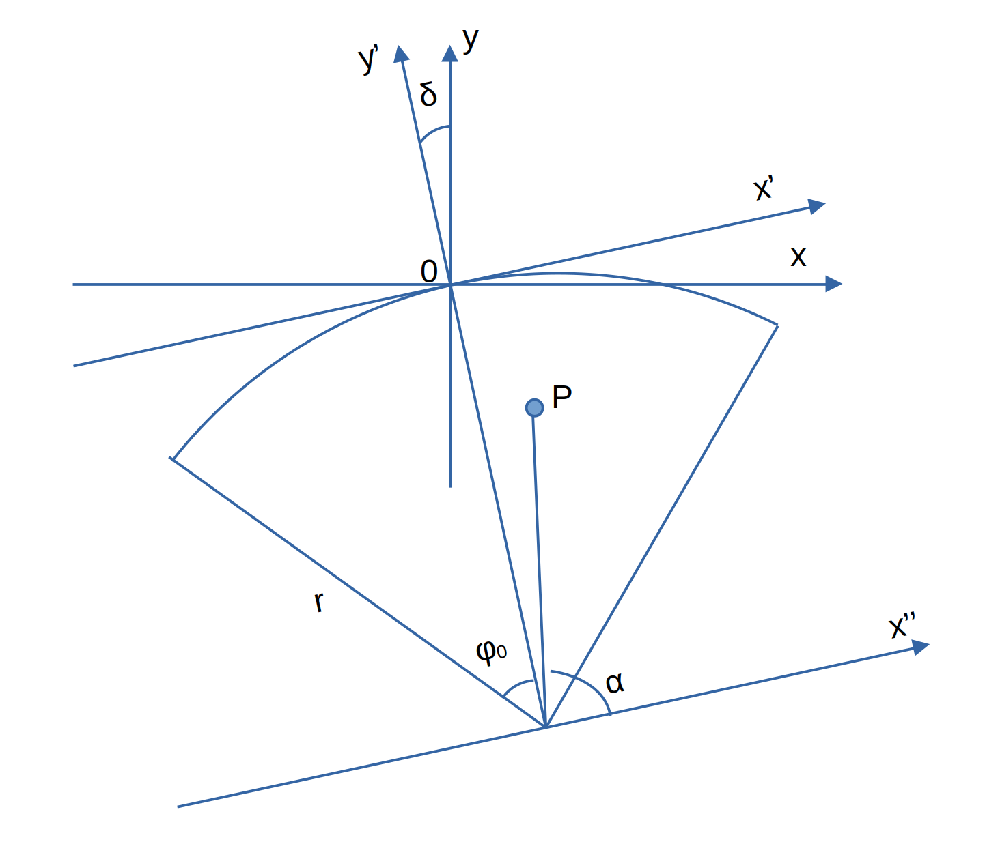

# Simple 3D scene from scratch

## Update 2022-12-21

Remade with triangles and some (almost) good lighting.

Below is somewhat lengthy derivation. I'll make it more clear later. 

And of course, there are still some issues with the program (the rotation doesn't work as intended, and I haven't figured out how to zoom yet).

## Deriving the formulas

Let's try to create a 3D scene on screen, doing it from scratch, and using only a 2D renderer (macroquad in this case).

First, we figure out the most simple case of a fixed camera.

From the diagram we can see that

$$\alpha + \phi = \frac{\pi}{2} + \phi_0 $$

$$\beta + \theta = \frac{\pi}{2} + \theta_0 $$

On the other hand:

$$\alpha = \text{atan} \frac{y}{x} $$

$$\beta = \text{atan} \frac{y}{z} $$

But it's better to use acos instead of atan, because we won't have to deal with division by zero.

So we have:

$$ \phi = \frac{\pi}{2} + \phi_0 - \text{acos} \frac{x}{\sqrt{x^2 + y^2}} $$

$$ \theta = \frac{\pi}{2} + \theta_0 - \text{acos} \frac{z}{\sqrt{y^2 + z^2}} $$

Or, for the coordinates on screen:

$$ u = r \phi = r \left(\frac{\pi}{2} + \phi_0 - \text{acos} \frac{x}{\sqrt{x^2 + y^2}} \right) $$

$$ v = r \theta = r \left( \frac{\pi}{2} + \theta_0 - \text{acos} \frac{z}{\sqrt{y^2 + z^2}} \right) $$

There also should be clear order of rendering, because otherwise we'll see far-away objects through the ones that are closer to us.

Since this version of the program works with triangles, we are going to order them according to the distance between midpoint and the camera.

## Summary for fixed camera

So for this case, if we want to render a points, all we need to do is to start its data:

$$ x, y, z$$

And then calculate its on-screen coordinates according to:

$$ u = r \left(\frac{\pi}{2} + \phi_0 - \text{acos} \frac{x}{\sqrt{x^2 + y^2}} \right) $$

$$ v = r \left( \frac{\pi}{2} + \theta_0 - \text{acos} \frac{z}{\sqrt{y^2 + z^2}} \right) $$

## Rotating camera

To figure out the moving camera, we have to actually change the origin for our coordinate system. 

First, let's shift x and z axes by r as shown here:

Now we have to replace all the y coordinates in the previous formulas by:

 $$y' = y + r $$

 This is going to be our camera's defaut position. But what happens if we rotate our coordinates around the new z axis?

 Let's look at the picture. 
 
 
 
 For this kind of rotation we'll actually need to use the rotation matrix, but we'll just write down the final formulas:

 $$x' =  x \cos \delta + y \sin \delta $$

 $$y' =  r - x \sin \delta + y \cos \delta $$

## Summary for rotating camera

Start with:

$$ x, y, z$$

And then calculate the on-screen coordinates according to:

 $$x^\prime =  x \cos \delta + y \sin \delta $$

 $$y^\prime =  r -x \sin \delta + y \cos \delta $$

 $$ \phi = \frac{\pi}{2} + \phi_0 - \text{acos} \frac{x^\prime}{\sqrt{x^{\prime 2} + y^{\prime 2}}} $$

$$ \theta = \frac{\pi}{2} + \theta_0 - \text{acos} \frac{z}{\sqrt{y^{\prime 2} + z^2}} $$

$$ u = r \phi $$

$$ v = r \theta $$

We'll also need to define according to screen size:

$$r, \phi_0, \theta_0 $$

We should put $\phi_0$ to something like 45 degrees, and then $r, \theta_0$ are defined as:

$$r = \frac{W}{2 \phi_0} = \frac{2}{\pi} W $$

$$\theta_0 = \phi_0 \frac{H}{W} = \frac{\pi}{4} \frac{H}{W} $$

where $W, H$ are the screen width and height.

We also need to ensure that:

$$ \phi \in [0, 2\phi_0] $$

$$ \theta \in [0, 2\theta_0] $$

Otherwise, the objects are not in the field of view and shouldn't be rendered.

---

To account for rotation in both directions, we have to compose two rotaions:

$$x^\prime =  x \cos \delta + y \sin \delta $$

 $$y^\prime =  -x \sin \delta + y \cos \delta $$

 $$z^\prime = z $$

 And:

 $$x^{\prime \prime} =  x^\prime$$

 $$y^{\prime \prime} =  r -z^\prime \sin \gamma + y^\prime \cos \gamma $$

 $$z^{\prime \prime} = x^\prime \cos \gamma + y^\prime \sin \gamma $$

## Lighting

For the lighting, we create a point source, and then derive the intensity from scalar product of two vectors: the path between light source and the midpoint of a triangle, and the normal vector of the triangle.

Still need to figure out how to account for the shade.
